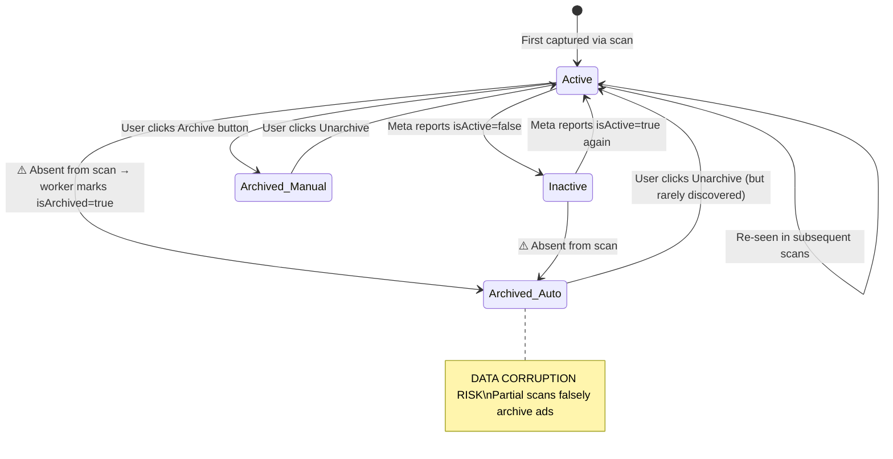

# Ad Spy Feed — Comprehensive Analysis Report

> Deep-dive analysis of the ad lifecycle management, UX friction points, and technical bottlenecks across the full extraction → storage → display pipeline.

---

## Part 1: Ad Lifecycle Management

### How Ad Status Is Currently Determined

The system tracks ad status through **three orthogonal signals** stored across two tables:

| Signal | Source | Storage |
|---|---|---|
| **`isActive`** | Meta's GraphQL payload (`node.isActive`) or DOM text ("Inactive"/"غير نشط") | `ad_observations.is_active` |
| **`isArchived`** | Worker reconciliation logic OR manual user toggle | `ads.is_archived` + `ads.archived_at` |
| **`lastSeenAt`** | Updated on every scan that re-encounters the ad | `ads.last_seen_at` |

### State Machine: How an Ad Flows Through the System



### Current Status Display Logic

The [ad-card.tsx](file:///c:/Users/Anis/Desktop/Vibe%20coding/meta%20brand%20result/components/spy/ad-card.tsx#L111-L127) renders status with this priority:

1. **Archived** (purple badge) — if `isArchived === true`
2. **Active** (green badge) — if `isActive === true` AND not archived
3. **Inactive** (gray badge) — if `isActive === false`
4. **Unknown** (amber badge) — fallback when `isActive` is null/undefined

### Where Do Disabled/Archived Ads Go?

Currently, there is **no dedicated "Archived" view** in the main `/spy` feed:

- The [spy-filters.tsx](file:///c:/Users/Anis/Desktop/Vibe%20coding/meta%20brand%20result/components/spy/spy-filters.tsx#L182-L194) status filter only offers `All Statuses`, `Active Only`, and `Inactive Only` — **"Archived" is missing from the filter dropdown** despite the API supporting `status=archived`
- The [page-ad-library-drawer.tsx](file:///c:/Users/Anis/Desktop/Vibe%20coding/meta%20brand%20result/components/spy/page-ad-library-drawer.tsx#L68-L100) has an **"Archived Vault" tab** — but this is only accessible per-brand from the main dashboard drawer, not from the global `/spy` feed
- The API route's default query (`status=all`) includes archived ads mixed in with active ones, making them hard to distinguish

> [!CAUTION]
> **Archived ads are effectively invisible.** A user archiving an ad from the feed has no way to find it again from `/spy` unless they know which brand it belongs to and open the per-brand drawer.

---

## Part 2: Critical Bugs

### 🔴 BUG 1: Unsafe Archive Reconciliation (Data Corruption)

**Severity:** Critical — causes silent data loss

**Location:** [spy-scanner.ts:402-432](file:///c:/Users/Anis/Desktop/Vibe%20coding/meta%20brand%20result/worker/spy-scanner.ts#L402-L432)

**Root cause:** After every scan — including partial ones — the worker queries ALL previous observations for the tracked page, then marks any ad not found in the current scan as `isArchived = true`:

```typescript
// Lines 402-432: Runs UNCONDITIONALLY after saving ads
const previousObservations = await db.query.adObservations.findMany({
  where: eq(adObservations.trackedPageId, trackedPageId),
});
// ... marks missing ads as archived
```

**Impact:** If a scan only captures 50 of 200 ads (due to scroll limits, timeouts, CAPTCHA interruption, or rate limiting), the other 150 ads are **permanently marked as archived**, corrupting historical data.

**This directly violates the project's own design rule** from [scraping_implementation_plan.md:87](file:///c:/Users/Anis/Desktop/Vibe%20coding/meta%20brand%20result/scraping_implementation_plan.md#L87):
> *"A missing ad only means inactive when Meta explicitly reports it as inactive—not because it was absent from a capped, failed, or partial scan."*

**Proposed fix:** Only run reconciliation when:
1. `finalStatus === "completed"` (the scroll loop exhausted naturally, not hit limits)
2. The scan extracted ≥ the count from the previous completed scan for that page

For `partial` scans, skip reconciliation entirely.

---

### 🔴 BUG 2: Inverted Completion Status Logic

**Severity:** High — partially completed scans are mislabeled

**Location:** [spy-scanner.ts:444-445](file:///c:/Users/Anis/Desktop/Vibe%20coding/meta%20brand%20result/worker/spy-scanner.ts#L444-L445)

```typescript
const finalStatus: "completed" | "partial" =
  noProgressCount >= NO_PROGRESS_CAP ? "completed" : "partial";
```

**Problem:** This logic marks a scan as `"completed"` only when the no-progress cap is hit (meaning the scroll loop stopped because nothing new came in). But if the scan exits because `MAX_SCROLL_ATTEMPTS` was reached — which means we likely missed ads — it's marked as `"partial"`. However, the reconciliation on lines 402-432 runs **regardless of status**, meaning even "partial" scans falsely archive ads.

---

## Part 3: UX Audit — 9 Friction Points

### UX-1: Full-Page Loading Spinner Destroys Context

**Severity:** High | **File:** [page.tsx:118-122](file:///c:/Users/Anis/Desktop/Vibe%20coding/meta%20brand%20result/app/spy/page.tsx#L118-L122)

When `isLoading` is true, the entire grid is unmounted and replaced with a centered spinner. Changing page, changing filters, or even refreshing causes:
- Complete loss of scroll position
- Visual "flash" of empty space → spinner → new content
- No continuity between the old and new data

**Fix:** Introduce `isFetchingMore` state. Show skeleton overlay on top of existing cards during transitions. Only show the full spinner for initial empty-state loads.

---

### UX-2: No Infinite Scroll — Mandatory Pagination

**Severity:** Medium | **File:** [page.tsx:158-183](file:///c:/Users/Anis/Desktop/Vibe%20coding/meta%20brand%20result/app/spy/page.tsx#L158-L183)

The feed uses Previous/Next page buttons that replace the entire card set. For an ad spy workflow where users scan through hundreds of ads, this creates constant clicking friction.

**Fix:** Add `IntersectionObserver` sentinel at the bottom of the grid. When it enters viewport, append the next page's results to the existing array. Keep pagination buttons as a secondary navigation option.

---

### UX-3: Missing "Archived" Filter in Main Feed

**Severity:** High | **File:** [spy-filters.tsx:185-193](file:///c:/Users/Anis/Desktop/Vibe%20coding/meta%20brand%20result/components/spy/spy-filters.tsx#L185-L193)

The status dropdown only offers `All`, `Active`, and `Inactive`. The `"archived"` status is supported by the API ([route.ts:93-95](file:///c:/Users/Anis/Desktop/Vibe%20coding/meta%20brand%20result/app/api/spy/ads/route.ts#L93-L95)) but not exposed in the UI.

Users who archive ads from cards have no way to find them in the global feed.

**Fix:** Add `Archived (Vault)` option to the status select. Consider also adding a separate "Ad Vault" view or section.

---

### UX-4: No Archive/Unarchive in List View

**Severity:** Medium | **File:** [ad-row.tsx](file:///c:/Users/Anis/Desktop/Vibe%20coding/meta%20brand%20result/components/spy/ad-row.tsx)

The `AdCard` component has archive toggle functionality with visual feedback. The `AdRow` (list view) component has **no archive button at all** — no `Archive` icon, no `onArchiveToggle` prop, no state management. Users switching to list view lose the ability to manage ad lifecycle.

**Fix:** Port the archive toggle from `AdCard` to `AdRow`.

---

### UX-5: Archived Status Not Shown in List View

**Severity:** Low | **File:** [ad-row.tsx:117-131](file:///c:/Users/Anis/Desktop/Vibe%20coding/meta%20brand%20result/components/spy/ad-row.tsx#L117-L131)

The `AdRow` component renders Active/Inactive/Unknown badges but has no "Archived" badge rendering — it doesn't check `ad.isArchived` at all.

---

### UX-6: Search Debounce Missing — Every Keystroke Fires an API Call

**Severity:** Medium | **File:** [spy-filters.tsx:58](file:///c:/Users/Anis/Desktop/Vibe%20coding/meta%20brand%20result/components/spy/spy-filters.tsx#L58)

```tsx
onChange={(e) => onFilterChange({ search: e.target.value })}
```

Each keystroke calls `onFilterChange` → `updateFilters` → resets page to 1 → triggers `fetchFeed`. Typing "nike shoes" fires 10 separate API requests.

**Fix:** Add a 300-400ms debounce on search input before calling `onFilterChange`.

---

### UX-7: No Bulk Actions

**Severity:** Low

Users can only archive/unarchive one ad at a time via clicking individual card buttons. For feeds with hundreds of ads, there's no way to:
- Select multiple ads and archive them in batch
- "Archive all inactive" in one click
- Export selected ads

---

### UX-8: Date Preset Selection Broken — Wrong Default Value

**Severity:** Low | **File:** [spy-filters.tsx:131-136](file:///c:/Users/Anis/Desktop/Vibe%20coding/meta%20brand%20result/components/spy/spy-filters.tsx#L131-L136)

```tsx
value={showCustomDates ? "custom" : filters.dateFrom ? "7days" : "all"}
```

If the user selects "Today", the select's controlled value resolves to `"7days"` (because `filters.dateFrom` is truthy), showing the wrong preset label.

---

### UX-9: No Scan Freshness Indicator

**Severity:** Low

Users have no visibility into when ads were last scanned or how fresh the data is. The `lastSeenAt` and `firstSeenAt` fields exist in the database but aren't surfaced in the feed cards.

---

## Part 4: Technical Bottlenecks

### TECH-1: N+1 Signed URL Calls — Primary Latency Source

**Severity:** Critical | **File:** [route.ts:160-207](file:///c:/Users/Anis/Desktop/Vibe%20coding/meta%20brand%20result/app/api/spy/ads/route.ts#L160-L207)

The API route creates a Supabase client and calls `createSignedUrl()` individually for every row:

```typescript
const items = await Promise.all(
  rows.map(async (row) => {
    // Each call is a network roundtrip to Supabase Storage
    const { data } = await supabaseClient.storage
      .from("ad-thumbnails")
      .createSignedUrl(row.thumbnailStoragePath, 3600);
    ...
  })
);
```

For a page of 24 ads, that's **24 sequential network roundtrips** before the API can respond. This is the #1 cause of feed latency (2-4s response times).

**The irony:** The worker already stores a public URL via `getPublicUrl()` in [thumbnail-cache.ts:78-80](file:///c:/Users/Anis/Desktop/Vibe%20coding/meta%20brand%20result/worker/thumbnail-cache.ts#L78-L80) and saves it to `ads.thumbnailUrl`. The signed URL generation is completely redundant if the bucket is configured as public.

**Fix:** Remove the entire `createClient` + `createSignedUrl` loop. Use the already-stored `row.thumbnailUrl` directly.

---

### TECH-2: Redundant Count Query with Full Join

**Severity:** Medium | **File:** [route.ts:150-157](file:///c:/Users/Anis/Desktop/Vibe%20coding/meta%20brand%20result/app/api/spy/ads/route.ts#L150-L157)

The API runs a separate `SELECT count(distinct ads.id)` with the same 3-table join and `WHERE` clause as the main query. This duplicates the query planner work.

**Fix:** Use `sql<number>\`SELECT count(*) FROM ${subquery}\`` or add a window function `count(*) OVER()` to the main query.

---

### TECH-3: Missing Composite Indexes on `ad_observations`

**Severity:** Medium | **File:** [schema.ts:159-165](file:///c:/Users/Anis/Desktop/Vibe%20coding/meta%20brand%20result/db/schema.ts#L159-L165)

The API's CTE uses `DISTINCT ON (ads.id)` with `ORDER BY ads.id, ad_observations.observed_at DESC`. The `observedAt` column has **no index**, forcing sequential scans on large observation tables.

**Missing indexes:**
- `(adId, observedAt DESC)` — supports `DISTINCT ON` + `ORDER BY`
- `(trackedPageId, observedAt DESC)` — supports filtered page queries

---

### TECH-4: Scroll Strategy Doesn't Reach Internal Container

**Severity:** High | **File:** [spy-scanner.ts:279-282](file:///c:/Users/Anis/Desktop/Vibe%20coding/meta%20brand%20result/worker/spy-scanner.ts#L279-L282)

```typescript
await page.evaluate(() => {
  window.scrollBy(0, 1600);
  window.scrollTo(0, document.body.scrollHeight);
});
```

Meta Ad Library renders cards inside an internal scroll container (`div[role="feed"]` or overflow container). Scrolling `window` doesn't dispatch scroll events on that container, so Meta's infinite-loading GraphQL pagination is never triggered for pages with many ads.

---

### TECH-5: DOM Extraction Only Runs Once, After Scroll Loop

**Severity:** High | **File:** [spy-scanner.ts:304-326](file:///c:/Users/Anis/Desktop/Vibe%20coding/meta%20brand%20result/worker/spy-scanner.ts#L304-L326)

Meta uses DOM virtualization — cards at the top are removed as the user scrolls. `extractAdsFromDOM` runs only after all scrolling is complete, so it only captures the bottom-most visible cards.

**Fix:** Run DOM extraction interleaved during the scroll loop (e.g., every 5th scroll iteration).

---

### TECH-6: GraphQL Response Parsing Fragility

**Severity:** Medium | **File:** [spy-scanner.ts:209-210](file:///c:/Users/Anis/Desktop/Vibe%20coding/meta%20brand%20result/worker/spy-scanner.ts#L209-L210)

```typescript
const text = await response.text();
const json = JSON.parse(text);
```

Meta sometimes prefixes GraphQL responses with `for (;;);` (anti-XSSI) and may return NDJSON (newline-delimited JSON). Both cause `JSON.parse` to throw, silently losing an entire batch of ~25 ads.

---

### TECH-7: `snapshot` Key Skipped in Recursion

**Severity:** Medium | **File:** [spy-scanner.ts:176](file:///c:/Users/Anis/Desktop/Vibe%20coding/meta%20brand%20result/worker/spy-scanner.ts#L176)

```typescript
if (key !== "snapshot" && typeof obj[key] === "object") {
```

This skips recursing into `"snapshot"` keys, but Meta sometimes nests ad collections inside `snapshot.cards`. The deduplication map already prevents duplicates, so this guard is unnecessary and causes missed ads.

---

### TECH-8: Conservative Scroll Constants

**Severity:** Medium | **File:** [spy-scanner.ts:34-36](file:///c:/Users/Anis/Desktop/Vibe%20coding/meta%20brand%20result/worker/spy-scanner.ts#L34-L36)

| Constant | Current | Recommended | Impact |
|---|---|---|---|
| `MAX_SCROLL_ATTEMPTS` | 30 | 50 | Capacity: ~150 ads → ~750 ads |
| `NO_PROGRESS_CAP` | 5 | 6 | Patience: 9s → 18s |
| `SCROLL_WAIT_MS` | 1800ms | 3000ms | More natural, catches slow GraphQL responses |

---

## Part 5: Priority Matrix

| Priority | Issue | Type | Effort |
|---|---|---|---|
| 🔴 P0 | Archive reconciliation data corruption (BUG-1 + BUG-2) | Bug | Small |
| 🔴 P0 | N+1 signed URL calls (TECH-1) | Performance | Small |
| 🟠 P1 | Missing "Archived" filter in feed (UX-3) | UX | Trivial |
| 🟠 P1 | Full-page spinner on pagination (UX-1) | UX | Medium |
| 🟠 P1 | Container-aware scrolling (TECH-4) | Extraction | Medium |
| 🟠 P1 | Interleaved DOM extraction (TECH-5) | Extraction | Small |
| 🟡 P2 | Infinite scroll (UX-2) | UX | Medium |
| 🟡 P2 | Search debounce (UX-6) | UX | Trivial |
| 🟡 P2 | GraphQL parsing resilience (TECH-6) | Extraction | Small |
| 🟡 P2 | Snapshot key recursion (TECH-7) | Extraction | Trivial |
| 🟡 P2 | Composite indexes (TECH-3) | Performance | Small |
| 🟡 P2 | Scroll constants tuning (TECH-8) | Extraction | Trivial |
| 🟢 P3 | Archive button in list view (UX-4) | UX | Trivial |
| 🟢 P3 | Archived badge in list view (UX-5) | UX | Trivial |
| 🟢 P3 | Count query optimization (TECH-2) | Performance | Small |
| 🟢 P3 | Date preset value bug (UX-8) | UX | Trivial |
| 🟢 P3 | Scan freshness indicator (UX-9) | UX | Small |
| 🟢 P3 | Bulk actions (UX-7) | UX | Large |

---

## Open Questions for You

> [!IMPORTANT]
> **1. Archived ads destination:** Right now archived ads are essentially "hidden" — no vault in the main feed. Do you want:
> - **Option A:** Add "Archived" to the status filter dropdown (minimum viable)
> - **Option B:** Create a dedicated "Ad Vault" section/page (`/spy/vault`) with its own archive management UI
> - **Option C:** Both — filter in main feed + dedicated vault page

> [!IMPORTANT]
> **2. Auto-archive behavior:** The current auto-archive reconciliation is dangerous. Once fixed, do you want the system to:
> - **Option A:** Never auto-archive — only archive when user manually clicks Archive
> - **Option B:** Auto-archive only after N consecutive complete scans where the ad is absent (e.g., 3 scans)
> - **Option C:** Mark as "Possibly Inactive" (soft label) rather than archiving, letting the user confirm

> [!IMPORTANT]
> **3. Implementation scope:** This report identifies 18 issues. Do you want me to:
> - **Option A:** Fix all P0 + P1 issues now (6 items — archive bug, signed URLs, missing filter, spinner, scroll strategy, DOM extraction)
> - **Option B:** Fix everything P0 through P2 (12 items)
> - **Option C:** Fix all 18 issues in one pass
