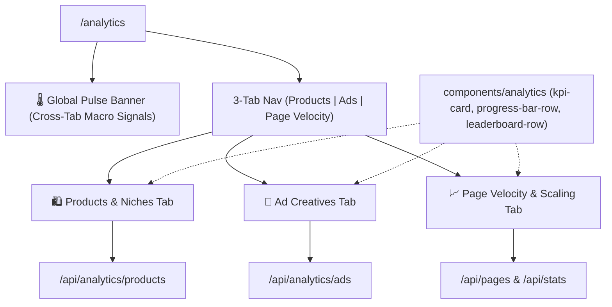

# Analytics Command Center — Product & Ad Creative Intelligence Plan (Updated)

Enhance `/analytics` into a **3-Pillar Analytics Command Center** with a **Global Market Pulse** bar, deep **Product & Winner Niches Intelligence**, **Ad Creatives & Campaign Dynamics**, and **Page Velocity & Scaling**.

---

## User Review Required

> [!IMPORTANT]
> **Key Architectural & Data Reliability Enhancements**:
> 1. **Global Market Pulse Banner**: A real-time cross-tab summary at the top of `/analytics` providing high-level macro intelligence (*Hottest Niche, Top Scaled CTA, Breakouts this week, Catalog Data Health*).
> 2. **Data Integrity & Date Fallback Guards**:
>    - Longevity Cohorts will use `COALESCE(startedRunningOn, firstSeenAt, createdAt)` to eliminate false "0-3 day" skew from missing dates.
>    - Price tier and average calculations include a **Data Quality Indicator** (`parsedPriceCount / totalProducts`).
>    - Catalog Classification Health indicator (`% products categorized`) prevents misinterpreting partially categorized datasets.
> 3. **High-Signal Media Buying Alpha**:
>    - **Scaled CTA Psychology**: CTA distribution filtered specifically on high-duplication ads ($\ge 5$ copies) to reveal true conversion funnels (WhatsApp COD vs Direct Checkout).
>    - **Concrete Saturation & Opportunity Formulas**:
>      - *Saturation Score* = count of distinct competitor domains selling the same product.
>      - *Opportunity Score* = $(\text{Active Ads in Niche} \div \text{Distinct Competitor Stores in Niche})$.
>    - **Max Duplication Sort** added to the Top Products Leaderboard.
> 4. **Shared UI Primitives First**: Build modular components in `components/analytics/` (`kpi-card`, `progress-bar-row`, `leaderboard-row`, `pulse-banner`) before assembling the tabs to ensure DRY, maintainable code.

---

## 1. Global Market Pulse Bar (Top Overview)

A persistent executive summary bar at the very top of `/analytics` before the tabs:
- 🔥 **Breakout Momentum**: Total ads launched in the last 7 days scaling with $\ge 3$ duplications.
- 🛍️ **#1 Winner Niche**: Niche with the highest ad-backed product count & median price sweet spot.
- ⚡ **Dominant Scaled CTA**: Most common CTA among top-scaled campaigns ($\ge 5$ ad sets).
- 🛡️ **Catalog Data Health**: % of products classified into niches & % with valid parsed pricing.

---

## 2. Product & Winner Niches Analytics Specification

### A. 🏆 Winner Niches Matrix & Profitability
- **Niche Market Share & Volume**: Total product count and percentage share per category (*Electronics & Tech*, *Beauty, Health & Care*, *Home & Kitchen*, *Fashion & Jewelry*, *Sports & Fitness*, *Kids & Toys*, *Automotive & Tools*, *General*).
- **Winner Concentration Rate**: Percentage of products in each niche that have active advertising momentum ($\ge 2$ linked active ads).
- **Median & Average Price by Niche**: Typical retail pricing per niche (in TND / local currency) to pinpoint sweet-spot pricing for COD/dropshipping.
- **Niche Opportunity vs Saturation Index**:
  - *Opportunity Score* = $\frac{\text{Total Active Ads in Category}}{\text{Distinct Competitor Domains in Category}}$ (high demand, low store count).
  - *Saturation Score* = Number of distinct domains selling identical product titles (Red Ocean clone alerts).
- **Offer & Promo Penetration**: Rate of discounts, bundle tiers ("Buy 2 Get 1"), and free shipping in each niche.
- **Sub-Category Granular Breakdown**: Ranking sub-niches (e.g., *Skincare*, *Smartwatches*, *Hair Care*, *Kitchen Gadgets*, *Pain Relief*) with average prices and top scaling products.

### B. 💰 Pricing & Profit Architecture
- **Price Band Distribution**:
  - 🟢 **Micro / Low (< 30 TND)**: Low friction, impulse purchases.
  - 🔵 **Sweet Spot (30 – 60 TND)**: High-volume dropshipping sweet spot.
  - 🟣 **Mid-Ticket (60 – 100 TND)**: High margin / bundle zone.
  - 🟠 **High-Ticket (100 – 200 TND)**: Tech & premium goods.
  - 🔴 **Ultra (> 200 TND)**: Heavy consideration / luxury.
- **Discount & Offer Spread**: Distribution of discount percentages and bundle deals (`allOffers`).
- **Delivery Strategy**: Ratio of Free Delivery vs Paid Delivery adoption.

### C. 🏬 Store Platform & Tech Stack Matrix
- **E-Commerce Engine Share**: Shopify vs YouCan vs WooCommerce vs Custom.
- **Tracking & Funnel Tech**: Meta Pixel presence rate and WhatsApp Direct Ordering adoption.

### D. 🌟 Top Winner Products Leaderboard
- Filterable & sortable leaderboard of top products by:
  - *Most Active Ads*
  - *Max Duplication / Scale Count*
  - *Longest Running (Evergreen)*
  - *Fast Scalers (New + High Ads)*
  - *Multi-Brand Battlegrounds* (products sold by 2+ distinct competitor stores).
- Interactive card/row with direct links to view creative ads in `/spy` and open detailed product intelligence modal.

---

## 3. Ad Creatives & Campaign Analytics Specification

### A. ⏱️ Ad Lifespan & Longevity Distribution (Survival Cohorts)
- **Longevity Cohorts Breakdown** (using `COALESCE(startedRunningOn, firstSeenAt, createdAt)`):
  - 🧪 **Testing Phase (0 – 3 days)**: Fresh test campaigns.
  - 🔍 **Validation Phase (4 – 7 days)**: Survived initial budget testing.
  - 📈 **Scaling Phase (8 – 14 days)**: Proven profitable, receiving budget.
  - 🏆 **Proven Winner (15 – 30 days)**: High confidence winner.
  - 🌲 **Evergreen Cash-Cow (30+ days)**: Core long-term revenue driver.
  - ❓ **Unknown Date**: Graceful fallback bucket for ads with unparseable timestamps.
- **Creative Survival Rate**: Percentage of ads that survive past 7 days and 14 days (revealing market creative fatigue).

### B. 🎬 Creative Format & Scaling Efficiency
- **Format Breakdown**: Video vs Static Image vs Carousel vs Unknown.
- **Scaling Efficiency by Format**: Average duplication count per format (e.g. Video avg duplication vs Image avg duplication).

### C. 📢 CTA (Call-to-Action) Conversion Psychology
- **All Ads CTA Distribution**: `Shop Now` vs `Order Now` vs `Send WhatsApp Message` vs `Learn More` vs `Call Now` vs `Get Offer`.
- **Top-Scaled CTA Alpha**: CTA distribution filtered specifically on ads with `duplicationCount >= 5` to reveal which CTAs actually power the biggest scaling campaigns.

### D. ✍️ Copywriting, Hook & Angle Analysis
- **Copy Length Tiers**: Short hook (< 100 chars), Medium pitch (100–300 chars), Long-form storytelling (> 300 chars).
- **Language Detection**:
  - *Arabic*: Contains Arabic Unicode range `[\u0600-\u06FF]`.
  - *French*: Contains French accented characters or French keywords (`livraison`, `prix`, `remise`).
  - *Bilingual*: Contains both Arabic and French signals.
- **Hook Triggers & Scarcity Signals**:
  - % mentioning discounts & promotions (`%`, `remise`, `تخفيض`, `solde`).
  - % mentioning urgency & scarcity (`gratuit`, `livraison gratuite`, `كمية محدودة`, `عرض خاص`).

### E. ⚡ Duplication & Scale Velocity Matrix
- **Duplication Scale Tiers**: Single (1 copy), Light Scale (2–4 copies), Medium Scale (5–9 copies), Aggressive Scale (10–19 copies), Mega Scale (20+ copies).
- **Breakout Scalers Leaderboard**: Ads launched in the last 7 days that have scaled aggressively ($\ge 3$ duplications).

### F. 🏢 Top Advertising Brands & Spend Velocity
- Brands launching the highest volume of unique creatives.
- Brand creative diversity (ratio of video vs image per brand).

---

## 4. Proposed Architecture & Component Structure

### Files to Create & Modify:

#### 1. Shared UI Primitives
- **[NEW]** `components/analytics/pulse-banner.tsx`: Global high-signal macro metric strip.
- **[NEW]** `components/analytics/kpi-card.tsx`: Standardized card with trend badge, tooltip, and glass styling.
- **[NEW]** `components/analytics/progress-bar-row.tsx`: Reusable labeled bar row with count, percentage, and customizable gradient.
- **[NEW]** `components/analytics/leaderboard-row.tsx`: Unified ranking row for top products and breakout ads.

#### 2. Backend APIs
- **[NEW]** `app/api/analytics/products/route.ts`:
  - Categories & sub-categories aggregation with avg/min/max price and offer penetration.
  - Data quality indicators (`parsedPriceCount`, `classifiedCount`).
  - 5-tier price band histogram.
  - Platform share and funnel tech breakdown (Pixel, WhatsApp).
  - Cross-store clone detection (saturation score).
  - Top winner products with max duplication and days running.
- **[NEW]** `app/api/analytics/ads/route.ts`:
  - Longevity survival cohorts using `COALESCE(startedRunningOn, firstSeenAt, createdAt)`.
  - Creative format distribution & avg duplication efficiency.
  - General CTA vs Scaled CTA ($\ge 5$ duplicates) comparison.
  - Copy length distribution, language classification, and scarcity trigger rates.
  - Duplication scale tiers and top breakout ads leaderboard.
  - Top brand creative producers.

#### 3. Frontend Tabs & Page
- **[NEW]** `components/analytics/product-analytics-tab.tsx`: Complete Winner Niches, Pricing Architecture, Platform Matrix, and Product Leaderboard view.
- **[NEW]** `components/analytics/ad-analytics-tab.tsx`: Complete Longevity Cohorts, Format Efficiency, CTA Psychology, Copy Hooks, and Breakout Scalers view.
- **[NEW]** `components/analytics/brand-analytics-tab.tsx`: Clean modularization of the existing Page Velocity & Scaling dashboard.
- **[MODIFY]** `app/analytics/page.tsx`: Unified Command Center with tab switching, URL query sync (`?tab=products`), search filtering, global refresh, and the Global Pulse banner.

---

## 5. Verification Plan

### Automated / API Verification:
- Validate `GET /api/analytics/products`: Verify response JSON includes `summary`, `categories`, `subCategories`, `priceTiers`, `platforms`, `topProducts`, and `dataQuality`.
- Validate `GET /api/analytics/ads`: Verify response JSON includes `longevityCohorts`, `formatEfficiency`, `ctaPsychology`, `copyIntelligence`, `duplicationTiers`, and `breakoutAds`.
- Check response latency ($\le 100\text{ms}$).

### Manual Verification:
- Navigate to `/analytics` in the browser.
- Switch between **🛍️ Products & Niches**, **🎯 Ad Creatives**, and **📈 Page Velocity** tabs.
- Verify that Global Pulse banner updates accurately.
- Test in both Light and Dark themes for visual clarity.
- Verify interactive links: clicking a product opens its modal / `/products`, clicking an ad links to `/spy`.
