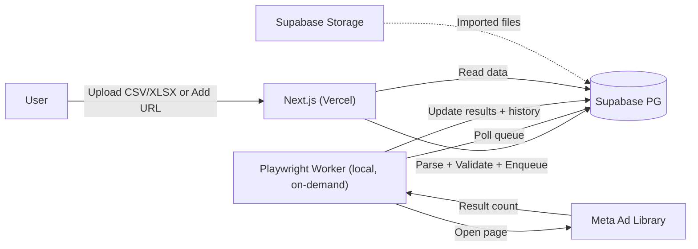

# Meta Ad Library Tracker — Implementation Plan

> Based on [Meta-Ad-Library-Tracker-PRD-v1.1.md](file:///c:/Users/Anis/Desktop/Vibe coding/meta brand result/Meta-Ad-Library-Tracker-PRD-v1.1.md) (Version 1.2)

---

## Overview

Build a single-user web application that monitors Meta Ad Library search URLs and tracks visible result counts over time. The system comprises two deployable units:

1. **Next.js frontend + API** — deployed to Vercel
2. **Playwright worker** — run **manually and on-demand on a local machine** (no always-on VPS hosting required)

Both talk to a shared **Supabase PostgreSQL** database.



> [!NOTE]
> The worker is a local Node.js/Playwright process started by hand when a scan session is wanted. It connects to the same Supabase database as the Vercel-hosted frontend, so the dashboard reflects results as soon as a local run finishes. This "bursty, human-triggered" pattern is inherently closer to normal browsing behavior than a permanently running scraper (PRD §4).

---

## User Review Required

> [!IMPORTANT]
> **Tech stack — TailwindCSS**: The PRD specifies TailwindCSS + shadcn/ui. I'll use **TailwindCSS v4** (latest) with shadcn/ui. Please confirm if you'd prefer v3 instead.

> [!IMPORTANT]
> **Supabase project**: Do you already have a Supabase project created, or should Phase 1 include creating one via the Supabase CLI/dashboard?

> [!IMPORTANT]
> **Deployment timing**: Should deployment setup (Vercel config) be included from Phase 1, or should we focus on local development first and handle deployment as a final phase?

---

## Open Questions

1. **Supabase Storage bucket**: Should imported CSV/XLSX files be stored in a specific bucket name (e.g. `imports`), or is the default fine?
2. **Worker communication**: The PRD mentions a dashboard kill switch. The plan uses a `worker_state` table the worker polls — is that acceptable, or do you prefer a different mechanism?
3. **Queue pruning**: PRD §16 mentions archiving completed queue jobs after 30 days. Should this be a Supabase cron (`pg_cron` extension) or a standalone script run manually?
4. **Domain / URL**: Do you have a custom domain for the Vercel deployment, or will we use the default `.vercel.app` domain?

---

## Phase 1: Project Scaffolding & Configuration

Set up the Next.js project with all dependencies and configuration files.

### Next.js App

#### [NEW] Project root (scaffolded via `create-next-app`)

Initialize with:
- Next.js 15 (App Router)
- TypeScript
- TailwindCSS
- ESLint
- `src/` directory disabled (use root `app/` per PRD §20)

#### [NEW] [package.json](file:///c:/Users/Anis/Desktop/Vibe coding/meta brand result/package.json)

Key dependencies to install after scaffolding:
| Category | Packages |
|---|---|
| UI | `@shadcn/ui`, TailwindCSS (via create-next-app) |
| Table | `@tanstack/react-table` |
| Forms | `react-hook-form`, `@hookform/resolvers`, `zod` |
| Database | `drizzle-orm`, `drizzle-kit`, `postgres` (pg driver) |
| File Import | `xlsx` (SheetJS) |
| Supabase | `@supabase/supabase-js`, `@supabase/storage-js` |
| Icons | `lucide-react` |

#### [NEW] [.env.local](file:///c:/Users/Anis/Desktop/Vibe coding/meta brand result/.env.local)

```env
# Supabase
SUPABASE_URL=
SUPABASE_KEY=
DATABASE_URL=

# Worker config (used by worker process, not Next.js — listed here for reference)
PLAYWRIGHT_HEADLESS=true
PAGE_TIMEOUT=30000
RESULT_PATTERN=(\\~?\\s?\\d[\\d,\\.]*)\\s+results?

WORKER_DELAY_MIN=2000
WORKER_DELAY_MAX=5000

MAX_SCANS_PER_HOUR=20
MAX_SCANS_PER_DAY=150
BATCH_SIZE=15
BATCH_COOLDOWN_MINUTES=20

MAX_CONSECUTIVE_FAILURES=3
BACKOFF_COOLDOWN_MINUTES=60

AUTO_START_THRESHOLD=50
```

#### [NEW] [drizzle.config.ts](file:///c:/Users/Anis/Desktop/Vibe coding/meta brand result/drizzle.config.ts)

Drizzle Kit configuration pointing to `DATABASE_URL`.

---

## Phase 2: Database Schema (Drizzle + Supabase)

Define all tables, indexes, and future-proof columns per PRD §9 and §23.

#### [NEW] [db/schema.ts](file:///c:/Users/Anis/Desktop/Vibe coding/meta brand result/db/schema.ts)

**Tables:**

| Table | Purpose |
|---|---|
| `tracked_pages` | Core entity — one row per unique Meta Ad Library URL |
| `scan_history` | Immutable log of every scan result |
| `import_jobs` | Record of each CSV/XLSX import |
| `queue` | Working table for pending/active scan jobs |
| `worker_state` | Single-row table for kill switch + state tracking (supports PRD §6 kill switch, backoff, scan caps) |

**`tracked_pages`** columns:
```
id              uuid PK default gen_random_uuid()
url             text NOT NULL UNIQUE
display_name    text
search_type     text
page_id         text
current_results integer
last_checked    timestamptz
last_success_at timestamptz
status          text DEFAULT 'pending'  -- pending | scanning | success | failed | unclear
created_at      timestamptz DEFAULT now()
updated_at      timestamptz DEFAULT now()

-- Future-proof fields (nullable, unused in V1 — PRD §23)
country         text
landing_page    text
ad_count        integer
video_count     integer
image_count     integer
notes           text
tags            text[]
ai_summary      text
last_creative_scan timestamptz
creative_hash   text
```

**`scan_history`** columns:
```
id              uuid PK
tracked_page_id uuid FK -> tracked_pages.id ON DELETE CASCADE
results         integer
difference      integer
checked_at      timestamptz DEFAULT now()
status          text  -- success | failed | unclear
failure_reason  text  -- timeout | navigation_error | element_missing | pattern_not_found | captcha | rate_limited (PRD §18)
```

**`import_jobs`** columns:
```
id              uuid PK
filename        text NOT NULL
file_path       text          -- Supabase Storage path
total_rows      integer DEFAULT 0
successful      integer DEFAULT 0
failed          integer DEFAULT 0
duplicates      integer DEFAULT 0
created_at      timestamptz DEFAULT now()
```

**`queue`** columns:
```
id              uuid PK
tracked_page_id uuid FK -> tracked_pages.id ON DELETE CASCADE
status          text DEFAULT 'pending'  -- pending | running | completed | failed
attempts        integer DEFAULT 0
failure_reason  text
created_at      timestamptz DEFAULT now()
started_at      timestamptz
finished_at     timestamptz
```

**`worker_state`** (single row — not in PRD §9 tables, but required to support kill switch §6, scan caps §6, and backoff §6):
```
id                      integer PK DEFAULT 1 CHECK (id = 1)
is_paused               boolean DEFAULT false
consecutive_failures    integer DEFAULT 0
last_failure_at         timestamptz
backoff_until           timestamptz
scans_this_hour         integer DEFAULT 0
hour_window_start       timestamptz
scans_today             integer DEFAULT 0
day_window_start        timestamptz
updated_at              timestamptz DEFAULT now()
```

**Indexes:**
- `tracked_pages.url` — UNIQUE (already via constraint)
- `tracked_pages.status` — B-tree
- `tracked_pages.page_id` — B-tree
- `scan_history.tracked_page_id` — B-tree
- `scan_history.checked_at` — B-tree (DESC)
- `queue.status` — B-tree
- `queue.created_at` — B-tree

#### [NEW] [db/index.ts](file:///c:/Users/Anis/Desktop/Vibe coding/meta brand result/db/index.ts)

Drizzle client initialization with `postgres` driver connecting to `DATABASE_URL`.

#### [NEW] [db/migrate.ts](file:///c:/Users/Anis/Desktop/Vibe coding/meta brand result/db/migrate.ts)

Migration runner script.

---

## Phase 3: Supabase Storage + File Import Pipeline

Handle CSV/XLSX upload, parsing, validation, deduplication, and queue insertion (PRD §7, §8).

#### [NEW] [lib/supabase.ts](file:///c:/Users/Anis/Desktop/Vibe coding/meta brand result/lib/supabase.ts)

Supabase client (server-side) for Storage operations.

#### [NEW] [lib/validators.ts](file:///c:/Users/Anis/Desktop/Vibe coding/meta brand result/lib/validators.ts)

- `isValidMetaAdLibraryUrl(url: string): boolean` — validates against `facebook.com/ads/library` (PRD §7)
- Zod schemas for import payloads and manual URL add payload

#### [NEW] [lib/url-parser.ts](file:///c:/Users/Anis/Desktop/Vibe coding/meta brand result/lib/url-parser.ts)

Extract metadata from URL (PRD §8):
- `page_id` from `view_all_page_id=...`
- `display_name` from `q=...`
- `search_type` inferred from URL structure (`page`, `keyword_exact_phrase`, `keyword_unordered`, etc.)

#### [NEW] [lib/file-parser.ts](file:///c:/Users/Anis/Desktop/Vibe coding/meta brand result/lib/file-parser.ts)

- Parse CSV/XLSX using SheetJS (`xlsx`)
- Extract the first column (or column named `url`)
- Return array of raw URL strings

#### [NEW] [actions/import.ts](file:///c:/Users/Anis/Desktop/Vibe coding/meta brand result/actions/import.ts)

Server action / utility orchestrating the full import flow:
1. Parse file → extract URLs
2. Validate each URL
3. Deduplicate against existing `tracked_pages`
4. Upload original file to Supabase Storage (`imports/` bucket)
5. Insert new `tracked_pages` rows
6. Create `queue` entries for each new page
7. Create `import_jobs` record with stats
8. Return summary (total, imported, duplicates, failed)

#### [NEW] [actions/add-url.ts](file:///c:/Users/Anis/Desktop/Vibe coding/meta brand result/actions/add-url.ts)

Server action for manually adding a single URL (PRD §7a):
1. Validate URL against `facebook.com/ads/library`
2. Check for duplicates against existing `tracked_pages` (by URL or resulting page_id/query)
3. Extract metadata (§8)
4. Insert `tracked_pages` row
5. Create `queue` entry as `pending`
6. Exempt from `AUTO_START_THRESHOLD` confirmation (single row)
7. Return result or duplicate message

#### [NEW] [app/api/import/route.ts](file:///c:/Users/Anis/Desktop/Vibe coding/meta brand result/app/api/import/route.ts)

`POST /api/import` — receives `multipart/form-data`, delegates to import action.

---

## Phase 4: API Routes (Backend)

Per PRD §21, all API routes are Next.js Route Handlers.

#### [NEW] [app/api/pages/route.ts](file:///c:/Users/Anis/Desktop/Vibe coding/meta brand result/app/api/pages/route.ts)

`GET /api/pages` — List tracked pages with:
- Pagination (cursor or offset)
- Search (display_name, page_id, url — case-insensitive `ILIKE`)
- Filter by status, search_type
- Sort by any column
- Include `previous_results` (subquery from `scan_history`)

`POST /api/pages` — Manually add a single Meta Ad Library URL (PRD §7a, §21):
- Accepts `{ url: string }`
- Delegates to `actions/add-url.ts`
- Returns the created tracked page or a duplicate message

#### [NEW] [app/api/history/[id]/route.ts](file:///c:/Users/Anis/Desktop/Vibe coding/meta brand result/app/api/history/[id]/route.ts)

`GET /api/history/:id` — Return scan history for a tracked page, ordered by `checked_at DESC`.

#### [NEW] [app/api/refresh/route.ts](file:///c:/Users/Anis/Desktop/Vibe coding/meta brand result/app/api/refresh/route.ts)

`POST /api/refresh` — Accept array of `tracked_page_id`s, create new `pending` queue entries.

#### [NEW] [app/api/retry/route.ts](file:///c:/Users/Anis/Desktop/Vibe coding/meta brand result/app/api/retry/route.ts)

`POST /api/retry` — Re-enqueue failed jobs. Respect retry-limit escalation (3+ failures → flag for manual review, per PRD §6).

#### [NEW] [app/api/page/[id]/route.ts](file:///c:/Users/Anis/Desktop/Vibe coding/meta brand result/app/api/page/[id]/route.ts)

`DELETE /api/page/:id` — Delete tracked page + cascade to scan_history and queue.

#### [NEW] [app/api/worker/route.ts](file:///c:/Users/Anis/Desktop/Vibe coding/meta brand result/app/api/worker/route.ts)

`GET /api/worker` — Return worker state (paused, backoff, scan counts).
`POST /api/worker` — Toggle kill switch (pause/resume) per PRD §6 Manual Kill Switch.

#### [NEW] [app/api/queue/confirm/route.ts](file:///c:/Users/Anis/Desktop/Vibe coding/meta brand result/app/api/queue/confirm/route.ts)

`POST /api/queue/confirm` — Manual confirmation to start processing large imports (PRD §16). Updates `worker_state` or a flag on the relevant queue batch.

#### [NEW] [app/api/stats/route.ts](file:///c:/Users/Anis/Desktop/Vibe coding/meta brand result/app/api/stats/route.ts)

`GET /api/stats` — Dashboard summary cards (total pages, pending, running, completed, failed, avg results, highest results, last import date — PRD §10).

---

## Phase 5: Playwright Worker (Local On-Demand Process)

This is a standalone Node.js process, **not** part of the Next.js app. It runs **locally on the developer's machine**, started by hand when a scan session is wanted (PRD §4). No Docker or VPS required for the worker in V1.

> [!IMPORTANT]
> **PRD §4 compliance**: The worker is explicitly a local, manual, on-demand process. It is NOT deployed to a VPS or run as an always-on service. A Docker setup is optional for convenience but not the primary deployment path.

### Worker Core

#### [NEW] [worker/index.ts](file:///c:/Users/Anis/Desktop/Vibe coding/meta brand result/worker/index.ts)

Main entry point — the core loop (PRD §16):
```
while (true) {
  1. Check worker_state.is_paused → sleep & continue
  2. Check backoff_until → sleep & continue
  3. Check hourly/daily caps → sleep & continue
  4. Check if batch cooldown needed → sleep & continue
  5. Fetch next pending queue job
  6. If none → exit (all done) or sleep 30s & continue
  7. Process job (call scanner)
  8. Update counters, check consecutive failures
  9. If batch complete → enter cooldown
}
```

#### [NEW] [worker/scanner.ts](file:///c:/Users/Anis/Desktop/Vibe coding/meta brand result/worker/scanner.ts)

The actual Playwright scanning logic (PRD §6):
1. Random delay before navigation
2. Navigate to URL with `networkidle` wait
3. Wait for result-count text pattern (match by **text pattern**, not a fixed CSS selector — PRD §6 Extraction note)
4. Extract number via configurable regex (`RESULT_PATTERN`)
5. Handle edge cases:
   - No `~` prefix (exact small numbers)
   - "No results found"
   - Localized text variations
   - If no matching pattern found → mark as `unclear` (not the same as a hard failure), store a note. Don't silently record `0` unless the page actually indicates zero results.
6. Fix locale/region explicitly (e.g. `Accept-Language` header or `country=` param) so results text format doesn't silently drift (PRD §6 Extraction)
7. Return `{ results: number | null, status: 'success' | 'failed' | 'unclear', failureReason?: string }`

### Worker Browser Management

#### [NEW] [worker/browser.ts](file:///c:/Users/Anis/Desktop/Vibe coding/meta brand result/worker/browser.ts)

Persistent browser management (PRD §6 Browser/Browser Profile):
- Launch **one** persistent Chromium instance at startup — never launch a browser for every request
- Persistent profile via `userDataDir` (cookies, cache, localStorage)
- Realistic viewport, user-agent, locale (`Accept-Language`)
- Only ONE active page at a time — no parallel workers (PRD §6 Concurrency)
- Reuse single page instance
- Graceful shutdown handler

### Worker Throttling & Safety

#### [NEW] [worker/throttle.ts](file:///c:/Users/Anis/Desktop/Vibe coding/meta brand result/worker/throttle.ts)

Throttling logic (PRD §6 Timing + Daily/Hourly Throttling):
- `randomDelay(min, max)` — per-action delays per PRD §6 table:
  | Step | Range |
  |---|---|
  | Before navigation | 2–5 sec |
  | After page load | 1–3 sec |
  | Before extracting | 0.5–1.5 sec |
  | Before next page | 3–8 sec |
- `checkHourlyCap()` / `checkDailyCap()` — rolling window checks against `worker_state`
- `incrementScanCount()` — update counters after each scan
- `checkBatchCooldown()` — process queue in batches with cool-down windows (e.g. scan 10–20 URLs, then pause 15–30 min) rather than draining continuously (PRD §6)

#### [NEW] [worker/backoff.ts](file:///c:/Users/Anis/Desktop/Vibe coding/meta brand result/worker/backoff.ts)

Failure backoff (PRD §6 Automatic Backoff on Failures):
- Track consecutive failures across the queue (not just per-URL retries) via `worker_state.consecutive_failures`
- When threshold exceeded (`MAX_CONSECUTIVE_FAILURES`, default 3–5) → set `backoff_until` to `now() + BACKOFF_COOLDOWN_MINUTES`
- This is a **global** signal that something about the current session has changed (CAPTCHA, rate-limiting, IP flagging) — distinct from a single URL's retry
- Reset counter on success
- Dashboard surfaces "Worker paused — repeated failures detected" state (PRD §6)

### Worker Database Layer

#### [NEW] [worker/db.ts](file:///c:/Users/Anis/Desktop/Vibe coding/meta brand result/worker/db.ts)

Worker-specific database operations:
- `getNextPendingJob()`
- `markJobRunning(id)`
- `markJobCompleted(id, results, difference)`
- `markJobFailed(id, reason)` — with distinct failure reasons per PRD §18
- `updateTrackedPage(id, results)`
- `insertScanHistory(pageId, results, diff, status, reason)`
- `getWorkerState()` / `updateWorkerState()`

### Access Check Script

#### [NEW] [scripts/check-access.ts](file:///c:/Users/Anis/Desktop/Vibe coding/meta brand result/scripts/check-access.ts)

Lightweight access check before a scan session (PRD §6 Access Check):
- Reuses the same Playwright context, extraction pattern, and settings as the real worker (same user agent, locale, persistent profile)
- Navigates to one known Meta Ad Library URL and classifies the outcome:
  - **Result pattern found** → access is working normally
  - **Page loaded, no pattern, CAPTCHA/challenge markers present** → flagged, do not proceed
  - **Navigation timeout/error** → likely network-level block (geo, ISP, DNS)
  - **"Not available in your region" style message** → Meta's legal/regional gating, informational
- Run this before starting a batch of scans. If it reports anything other than "working normally," hold off on running the full worker.

### Worker Configuration

#### [NEW] [worker/package.json](file:///c:/Users/Anis/Desktop/Vibe coding/meta brand result/worker/package.json)

Separate `package.json` for the worker with:
- `playwright`
- `drizzle-orm`, `postgres`
- `dotenv`

#### [NEW] [worker/tsconfig.json](file:///c:/Users/Anis/Desktop/Vibe coding/meta brand result/worker/tsconfig.json)

TypeScript config targeting Node.js.

#### [NEW] [worker/Dockerfile](file:///c:/Users/Anis/Desktop/Vibe coding/meta brand result/worker/Dockerfile)

Optional Docker container for convenience (not the primary deployment path):
```dockerfile
FROM mcr.microsoft.com/playwright:v1.50.0-noble
WORKDIR /app
COPY package*.json ./
RUN npm ci --production
COPY . .
CMD ["node", "dist/index.js"]
```

> [!NOTE]
> Docker is provided as an **optional** convenience for reproducible environments. The primary way to run the worker is directly via `npx ts-node worker/index.ts` or `node worker/dist/index.js` on the local machine (PRD §4).

---

## Phase 6: Frontend — Dashboard UI

> Theme: Modern SaaS, dark mode first, minimal, rounded cards, clean tables, no unnecessary animations, fast loading (PRD §22).

### Layout & Shell

#### [NEW] [app/layout.tsx](file:///c:/Users/Anis/Desktop/Vibe coding/meta brand result/app/layout.tsx)

Root layout with dark theme, font (Inter via Google Fonts), metadata.

#### [NEW] [app/page.tsx](file:///c:/Users/Anis/Desktop/Vibe coding/meta brand result/app/page.tsx)

Dashboard home — renders summary cards + main table + manual URL add.

#### [NEW] [app/import/page.tsx](file:///c:/Users/Anis/Desktop/Vibe coding/meta brand result/app/import/page.tsx)

Import page with drag-and-drop upload area.

---

### Components

#### [NEW] [components/stats-cards.tsx](file:///c:/Users/Anis/Desktop/Vibe coding/meta brand result/components/stats-cards.tsx)

Summary cards grid (PRD §10): Total Pages, Pending, Running, Completed, Failed, Average Results, Highest Results, Last Import.

#### [NEW] [components/pages-table.tsx](file:///c:/Users/Anis/Desktop/Vibe coding/meta brand result/components/pages-table.tsx)

TanStack Table with columns (PRD §11):
| Column | Notes |
|---|---|
| Display Name | Sortable, linked |
| Search Type | Badge styling |
| Current Results | Formatted number |
| Previous Results | From latest `scan_history` |
| Difference | Color-coded: green (+), red (-), gray (0) — PRD §11 |
| Status | Badge: pending/scanning/success/failed/unclear |
| Last Checked | Relative time (e.g. "2h ago") |
| Actions | Refresh, History, Retry, Delete buttons (PRD §11) |

Retry button behavior per PRD §6: if a URL has failed 3+ retries, don't show one-click retry — flag it for manual review instead.

#### [NEW] [components/add-url-form.tsx](file:///c:/Users/Anis/Desktop/Vibe coding/meta brand result/components/add-url-form.tsx)

Manual single URL add form (PRD §7a):
- Simple input field accepting one Meta Ad Library search link at a time
- Same validation as bulk import (`facebook.com/ads/library`)
- Shows duplicate message if URL/page already exists
- Submits to `POST /api/pages`
- Exempt from `AUTO_START_THRESHOLD` confirmation (single row)

#### [NEW] [components/search-bar.tsx](file:///c:/Users/Anis/Desktop/Vibe coding/meta brand result/components/search-bar.tsx)

Global search input (PRD §13) — searches display_name, page_id, URL.

#### [NEW] [components/filters.tsx](file:///c:/Users/Anis/Desktop/Vibe coding/meta brand result/components/filters.tsx)

Filter dropdowns (PRD §14): Status (Success, Pending, Running, Failed), Search Type (page, keyword, etc.).

#### [NEW] [components/history-modal.tsx](file:///c:/Users/Anis/Desktop/Vibe coding/meta brand result/components/history-modal.tsx)

Modal/sheet showing scan history table for a tracked page (PRD §12). Simple table with Date, Results, Difference, Status. No charts.

#### [NEW] [components/import-dropzone.tsx](file:///c:/Users/Anis/Desktop/Vibe coding/meta brand result/components/import-dropzone.tsx)

Drag-and-drop zone for CSV/XLSX (PRD §15). Shows upload progress and import results summary (rows, duplicates, imported, failed).

#### [NEW] [components/import-confirmation.tsx](file:///c:/Users/Anis/Desktop/Vibe coding/meta brand result/components/import-confirmation.tsx)

For large imports (> `AUTO_START_THRESHOLD`, PRD §15/§16): shows estimated completion time based on current rate limits and requires manual confirmation before worker starts.

#### [NEW] [components/worker-status.tsx](file:///c:/Users/Anis/Desktop/Vibe coding/meta brand result/components/worker-status.tsx)

Worker state indicator + kill switch toggle (PRD §6 Manual Kill Switch):
- Active / Paused / Backoff cooldown
- "Worker paused — repeated failures detected" when backoff is active (PRD §6)
- Scan counts (hour/day)
- Pause/Resume button — immediately pauses all worker activity

#### [NEW] [components/navigation.tsx](file:///c:/Users/Anis/Desktop/Vibe coding/meta brand result/components/navigation.tsx)

Sidebar or top nav: Dashboard, Import. Worker status indicator in header.

---

### Hooks

#### [NEW] [hooks/use-pages.ts](file:///c:/Users/Anis/Desktop/Vibe coding/meta brand result/hooks/use-pages.ts)

Fetch and manage tracked pages with search/filter/pagination state.

#### [NEW] [hooks/use-stats.ts](file:///c:/Users/Anis/Desktop/Vibe coding/meta brand result/hooks/use-stats.ts)

Fetch dashboard summary stats.

#### [NEW] [hooks/use-history.ts](file:///c:/Users/Anis/Desktop/Vibe coding/meta brand result/hooks/use-history.ts)

Fetch scan history for a specific tracked page.

#### [NEW] [hooks/use-worker.ts](file:///c:/Users/Anis/Desktop/Vibe coding/meta brand result/hooks/use-worker.ts)

Fetch and toggle worker state.

#### [NEW] [hooks/use-import.ts](file:///c:/Users/Anis/Desktop/Vibe coding/meta brand result/hooks/use-import.ts)

Handle file upload and import flow.

#### [NEW] [hooks/use-add-url.ts](file:///c:/Users/Anis/Desktop/Vibe coding/meta brand result/hooks/use-add-url.ts)

Handle manual single URL add flow — submit to `POST /api/pages`, handle validation errors and duplicate messages.

---

### Types

#### [NEW] [types/index.ts](file:///c:/Users/Anis/Desktop/Vibe coding/meta brand result/types/index.ts)

Shared TypeScript types:
- `TrackedPage`, `ScanHistoryEntry`, `ImportJob`, `QueueJob`, `WorkerState`
- `ImportResult`, `ScanResult`, `AddUrlResult`
- API request/response types
- Filter/search parameter types
- Failure reason enum: `timeout | navigation_error | element_missing | pattern_not_found | captcha | rate_limited`

---

## Phase 7: Security & Edge Cases

Per PRD §24.

#### [MODIFY] All API routes

- Add `X-API-Secret` header validation (optional, for public deployments)
- Validate all request bodies with Zod
- Sanitize file uploads (check MIME type, file size limits)
- Never execute uploaded content
- Rate limit API routes (optional middleware)

#### [NEW] [lib/api-guard.ts](file:///c:/Users/Anis/Desktop/Vibe coding/meta brand result/lib/api-guard.ts)

API secret validation middleware (checks `X-API-Secret` against env `API_SECRET`). Skipped if `API_SECRET` is not set (local dev).

---

## Phase 8: Deployment & DevOps

#### [NEW] [vercel.json](file:///c:/Users/Anis/Desktop/Vibe coding/meta brand result/vercel.json)

Vercel deployment config (if needed for rewrites/headers).

#### [NEW] [scripts/seed.ts](file:///c:/Users/Anis/Desktop/Vibe coding/meta brand result/scripts/seed.ts)

Seed `worker_state` with initial row + optional test data.

#### [NEW] [scripts/prune-queue.ts](file:///c:/Users/Anis/Desktop/Vibe coding/meta brand result/scripts/prune-queue.ts)

Script to archive/delete completed queue jobs older than 30 days (PRD §16 Queue Retention). `scan_history` remains the permanent record — `queue` is just the working table.

#### [NEW] [docker-compose.yml](file:///c:/Users/Anis/Desktop/Vibe coding/meta brand result/docker-compose.yml)

Optional — for local development convenience, runs the worker alongside the Next.js dev server.

---

## Folder Structure

Per PRD §20:

```
app/                    # Next.js App Router pages + API routes
  api/
    import/
    pages/
    page/[id]/
    history/[id]/
    refresh/
    retry/
    worker/
    queue/confirm/
    stats/
  import/               # Import page
components/             # React components
lib/                    # Shared utilities (validators, parsers, supabase client)
actions/                # Server actions (import, add-url)
hooks/                  # React hooks
types/                  # TypeScript types
db/                     # Drizzle schema, client, migrations
worker/                 # Playwright worker (standalone process)
  playwright/           # Browser management
  queue/                # Queue processing logic
  utils/                # Worker utilities (throttle, backoff)
scripts/                # Standalone scripts (check-access, seed, prune-queue)
public/                 # Static assets
```

---

## Execution Order & Dependencies

```mermaid
gantt
    title Development Phases
    dateFormat  X
    axisFormat %s

    section Foundation
    Phase 1 - Scaffolding           :p1, 0, 1
    Phase 2 - Database Schema       :p2, after p1, 1

    section Backend
    Phase 3 - Import Pipeline       :p3, after p2, 2
    Phase 4 - API Routes            :p4, after p2, 2

    section Worker
    Phase 5 - Playwright Worker     :p5, after p2, 3

    section Frontend
    Phase 6 - Dashboard UI          :p6, after p4, 3

    section Polish
    Phase 7 - Security              :p7, after p6, 1
    Phase 8 - Deployment            :p8, after p5, 1
```



> [!NOTE]
> Phases 3, 4, and 5 can proceed in parallel after Phase 2. Phase 6 depends on Phase 4 (API routes must exist for the UI to consume). Phase 7 applies retroactively across all routes. Phase 8 can begin as soon as the worker is ready.

---

## Verification Plan

### Automated Tests

```bash
# Run database migrations
npx drizzle-kit push

# Validate schema
npx drizzle-kit check

# Run unit tests (file parser, URL parser, validators)
npm test

# Test access check script
cd worker && npx ts-node ../scripts/check-access.ts

# Test worker locally (single URL)
cd worker && npx ts-node index.ts --test-url "https://www.facebook.com/ads/library/?active_status=active&ad_type=all&country=ALL&view_all_page_id=553391504532355"
```

### Manual Verification

| Test Case | Steps | Expected Result |
|---|---|---|
| CSV Import | Upload a CSV with 5 valid URLs + 2 invalid + 1 duplicate | 5 imported, 1 duplicate removed, 2 failed |
| XLSX Import | Upload an XLSX file with 10 URLs | 10 imported, queue populated |
| Manual URL Add | Add a single URL via the input form | 1 tracked page created, 1 queue entry |
| Manual URL Add (duplicate) | Add a URL that already exists | Duplicate message shown, no new row |
| Worker Scan | Let worker process 3 queued jobs | Results extracted, scan_history populated, differences calculated |
| Access Check | Run `scripts/check-access.ts` | Outcome classified (working / CAPTCHA / timeout / regional) |
| Kill Switch | Toggle pause in dashboard | Worker stops processing within current cycle |
| Backoff | Simulate 3+ consecutive failures | Worker enters cooldown, dashboard shows "Worker paused — repeated failures detected" |
| Large Import | Import 100+ URLs | Confirmation modal shown with time estimate |
| Search | Search by display name | Filtered results in table |
| Filters | Filter by status / search type | Table filtered correctly |
| History | Click History on a tracked page | Modal shows chronological scan entries |
| Retry | Click Retry on a failed job | Job re-enqueued as pending |
| Retry Escalation | Click Retry on a job that failed 3+ times | Flagged for manual review, not one-click retry |
| Delete | Delete a tracked page | Page + history + queue entries removed |
| 1000 URL Import | Import 1,000 URLs | UI does not block (PRD §25), confirmation shown |

### Build Validation

```bash
# Ensure Next.js builds without errors
npm run build

# Ensure worker compiles
cd worker && npx tsc --noEmit
```
