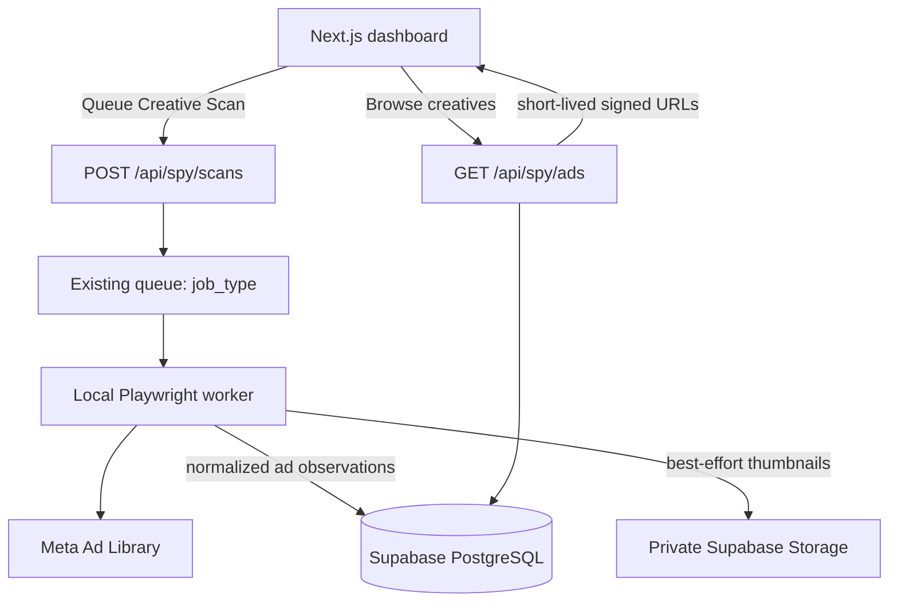

# Ad Creative Extraction — Hardened Implementation Plan

## Summary

Add a manual, **page-library-only** creative scanner that runs through the existing local Playwright worker and unified queue. It captures individual Meta ads while keeping result-count scans independent and preserving incomplete scan data safely.

### V1 Decisions

| Decision | Chosen approach |
| --- | --- |
| URL coverage | Only tracked URLs with `search_type = page` |
| Trigger | Manual scan of one or more selected pages |
| Worker | Existing local, single-threaded Playwright worker |
| Media | Cache private image/video thumbnails only; retain Meta CDN URLs as fallback |
| Inactive ads | Never infer inactivity from a failed, capped, or partial scan |

---

## Architecture

The frontend and API routes do not run Playwright. The local worker remains the only browser automation process and continues to respect the existing pause control, throttling, caps, and global failure backoff.

---

## Database and Queue Changes

Generate and apply a new Drizzle migration. Do **not** use `drizzle-kit push` against shared data.

### Extend `queue`

Add the following fields while keeping all existing rows valid:

* `job_type`: `count` (default) or `creative`.
* `creative_scan_id`: nullable reference to the new `creative_scans` record.

The worker claims both job types sequentially. Existing count jobs retain their current lifecycle exactly. Prevent duplicate pending/running creative jobs for the same tracked page.

### Add `creative_scans`

Create one row for each requested extraction attempt:

* `id`, `tracked_page_id`, queue linkage, `status` (`pending`, `running`, `completed`, `partial`, `failed`), and timestamps.
* Config snapshot: maximum cards/scrolls and timeout used for that scan.
* Outcome details: extracted count, completion reason, and normalized failure reason such as `captcha`, `rate_limited`, `payload_not_found`, `parse_error`, or `timeout`.

Update `tracked_pages.last_creative_scan` only after a `completed` or `partial` scan.

### Add `ads` and `ad_observations`

`ads` is the canonical creative record, uniquely keyed by Meta `ad_archive_id`. It stores the latest normalized ad content: page ID/name, launch timestamp, copy, title, CTA, target URL, media type, original source URLs, thumbnail metadata, first seen, and last seen.

`ad_observations` links each extracted ad to a specific `creative_scan` and tracked page. It stores scan-specific values such as Meta-reported active state, duplication/collation count, and observed timestamp.

This avoids the draft's unsafe one-to-one `ads.tracked_page_id` relationship: the same Meta ad can appear in more than one tracked page URL or scan without overwriting ownership or historical observations.

Add indexes for creative queue lookup, scan status/page/time, archive ID, observation scan/ad lookup, launch date, and duplication count.

---

## Worker and Media Pipeline

### Creative scanner

Add a dedicated scanner module invoked only for `creative` jobs.

* Confirm the job's tracked page has `search_type = page`; reject all other search types at enqueue time and again in the worker.
* Attach a temporary Playwright response listener before navigation, normalize matching GraphQL payloads through a versioned parser adapter, and remove listeners after every job so stale responses cannot leak into later scans.
* Do not persist raw GraphQL responses, request headers, cookies, or tokens.
* For long libraries, repeatedly scroll to trigger Meta's infinite loading, wait for new recognized payloads, and deduplicate every result by `ad_archive_id` before persistence.
* Stop scrolling only when Meta indicates the end of results, no new unique ads arrive after a configurable number of consecutive attempts, a configured scroll/card limit is reached, or the per-scan timeout/rate-limit condition occurs. Record a scan as `partial` when a configured limit or timeout is reached after valid extraction.
* Use configurable navigation timeout, response-size limit, scroll/card limit, no-progress-attempt limit, wait-between-scrolls interval, and per-scan timeout.
* If no safely recognized payload is found, record `payload_not_found`; malformed recognized data records `parse_error`. Do not substitute an HTML-selector scraper silently.
* Upsert canonical ads and insert observations transactionally after normalization.
* Store Meta's explicit active state when present; otherwise expose `unknown`. A missing ad only means inactive when Meta explicitly reports it as inactive—not because it was absent from a capped, failed, or partial scan.

### Thumbnail caching

Create a private Supabase Storage bucket named `ad-thumbnails`.

* The worker downloads only thumbnail-sized image/video-preview assets with strict MIME allowlist, byte limit, and timeout.
* Upload files under a deterministic path derived from the archive ID and content hash using a server-only Supabase service-role client. Never expose that key to browser code.
* Caching is best-effort: an expired URL, fetch failure, unsupported media type, or storage failure must not fail the creative scan.
* Retain source CDN URLs for traceability, but return short-lived signed thumbnail URLs from the API. Cards show an explicit unavailable-preview state when no cached or source preview can load.
* Do not cache full videos in V1.

---

## API and UI

### API routes

Add routes under `app/api/spy/` using the existing API-secret guard when `API_SECRET` is configured:

* `POST /api/spy/scans`: accepts one or more tracked-page UUIDs, validates page-only eligibility, creates a scan and creative queue job for each eligible page, and reports pages already queued.
* `GET /api/spy/ads`: paginated feed with validated `trackedPageId`, keyword, launch-date range, minimum-duplication, media type, status, sorting, page, and limit parameters. It returns latest observation data plus signed thumbnail URLs.
* `GET /api/spy/stats`: returns total captured ads, recent launches, scaled-ad count, and media-type distribution from successful/partial observations only.

Route handlers remain dynamic database-backed handlers; do not add static caching for feed or scan results.

### Dashboard

* Add an **Ad Spy** navigation item for `/spy` on desktop and mobile.
* Build `/spy` as a responsive, paginated feed with summary stats, search, launch-date, duplication, media type, active/unknown status, and sort controls.
* Ad cards show page name/ID, launch date, latest duplication count, reported status, thumbnail/unavailable preview, expandable copy, CTA destination, and a Meta Ad Library link.
* Add `Scan ads` and `View ads` actions only to `page` rows in the existing tracker table. `View ads` opens a page-filtered drawer or routes to the filtered feed.
* Show scan progress/errors from `creative_scans`; count-scan status must remain visually and behaviorally separate.

---

## Verification Plan

### Automated

* Unit-test page-only URL eligibility, request validation, duplicate creative-job prevention, parser fixtures, active/unknown status rules, and thumbnail-cache failure paths.
* Integration-test migration compatibility with existing count queue rows, creative enqueue-to-worker lifecycle, idempotent archive-ID upserts, observations for repeat scans, filters, pagination, sort validation, and signed thumbnail responses.
* Add redacted fixture payloads for supported Meta response shapes. No live response body belongs in repository fixtures.
* Run TypeScript, ESLint, and the production build.

### Manual

1. Queue a creative scan for a page-library URL and confirm the local worker processes it without changing existing result-count history.
2. Verify image, video-preview, carousel, expired-media, cache-failure, malformed-payload, CAPTCHA, rate-limit, and capped-scroll behavior.
3. Confirm a partial/failed scan never turns previously captured ads inactive.
4. Open `/spy`, exercise all filters and pagination, and verify the page-level `View ads` action returns only observations for that tracked page.
5. Confirm cached thumbnails are not publicly listable and signed preview links expire as expected.

## Acceptance Criteria

The feature is ready when a user can manually queue a supported page-library extraction, see its isolated job status, browse deduplicated creative records and scan observations, filter the feed, and preview cached thumbnails without exposing storage credentials or corrupting the existing result-count tracker.
